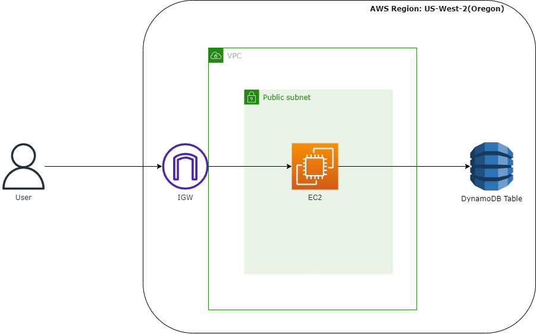

# Building a simple 3-tier web app on AWS

A simple 3-tier web app that logs user's information (name, log in time) when he/she logs in

To automate creation and management of this app, I use Terraform. Terraform is a Infrastructure as Code (IaC) tool that allow us to  manage infrastructure with configuration files rather than through a graphical user interface (AWS Console, for example)

In this project, I use Terraform to create following components on AWS:

- AWS VPC(Virtual Private Cloud)  
- VPC Subnet inside the VPC in which I run this app
- Internet Gateway to connect to the Internet from inside of VPC
- DynamoDb table where I save the log in data of users
- EC2 instance where I run the web app
- Instance profile with appropriate policy to use DynamoDB service 

Simple diagram of the architect (Thanks to drawio):

